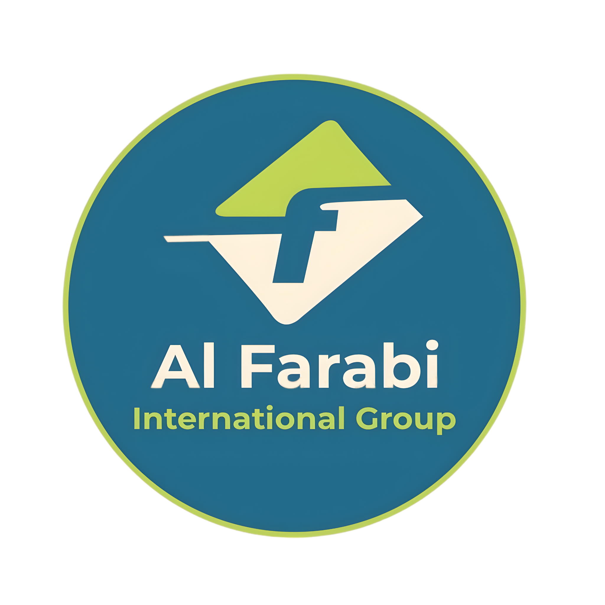

# 🌟 ALFarabi International Group

<div align="center">



**Professional Workforce Supply & Project Execution Services**

[🌐 Website](#) • [📧 Email](mailto:info@alfarabi.com) • [📱 Phone](#) • [📍 Location](#)

</div>

---

## 🏢 About ALFarabi

**ALFarabi International Group** is a leading provider of comprehensive workforce supply and project execution services across the Middle East and North Africa region. With operations centered in **Cairo** and **El Dabaa, Egypt**, we deliver excellence in:

- ✅ **Skilled Workforce Supply** - Certified professionals across all industries
- ✅ **Project Management** - End-to-end project execution
- ✅ **Equipment Rental** - Modern machinery and tools
- ✅ **Accommodation Services** - Comfortable worker housing
- ✅ **Engineering Solutions** - Technical expertise and innovation

---

## 🎯 Our Mission

To provide world-class workforce solutions that enable our clients to complete their projects **safely, efficiently, and on schedule** while maintaining the highest standards of professional conduct and worker safety.

---

## 💼 Core Services

### 🤝 Workforce Supply
- **500+ Professional Teams** ready for deployment
- **10,000+ Trained Workers** across multiple disciplines
- **100% Safety Certified** workforce
- Customizable crew compositions for any project

### 🏗️ Project Services
- Construction and infrastructure projects
- Industrial and manufacturing operations
- Hospitality and commercial development
- Energy and utility projects
- Technology infrastructure deployment

### 🛠️ Equipment & Infrastructure
- Heavy machinery rental and operation
- Accommodation and camp management
- Logistics coordination
- Safety and compliance management

---

## 📊 By The Numbers

| Metric | Value |
|--------|-------|
| **Professional Teams** | 500+ |
| **Trained Workers** | 10,000+ |
| **Safety Rating** | 100% |
| **Projects Completed** | 50+ |
| **Operating Countries** | 5 |
| **Years of Experience** | 15+ |

---

## 🌍 Our Locations

### 📍 Cairo Headquarters
- **Address:** Cairo, Egypt
- **Phone:** +20 2 1234 5678
- **Services:** Corporate management, project planning, HR & admin

### 📍 El Dabaa Regional Hub
- **Address:** El Dabaa, Egypt  
- **Services:** On-site operations, crew management, logistics

---

## 👥 Organization Structure

### Cairo Management Team
- **General Manager** - Strategic leadership and oversight
- **Operations Manager** - Day-to-day operations management
- **Finance Director** - Financial planning and management
- **HR Manager** - Human resources and recruitment
- **Sales Manager** - Business development
- **QA Director** - Quality assurance and standards
- **Projects Manager** - Project coordination
- **Safety Manager** - Health and safety compliance

### El Dabaa Operations Team
- **Regional Manager** - Regional operations oversight
- **Site Supervisor** - On-site crew supervision
- **Logistics Coordinator** - Materials and equipment management
- **HR Officer** - Regional HR and administration

---

## 👨‍💼 Standard 88-Person Crew Structure

Our **standard deployment** consists of a fully trained, certified team ready for immediate project engagement:

```
Total Crew: 88 People

Management & Supervision (8)
├── 1 Project Manager (PMP, NEBOSH, OSHA 30)
├── 2 Site Engineers (Civil Engineering, OSHA 30)
├── 4 Supervisors (HSE Certified)
└── 1 Safety Officer (NEBOSH, Risk Assessment)

Technical & Support (75)
├── 50 Skilled Workers (Trade Certifications)
├── 1 Medical Officer (RN/Paramedic)
├── 1 Logistics Coordinator
└── 4 Administrative Staff

Support Services (5)
├── Equipment Operators
├── Facility Management
└── Safety Personnel
```

### **Crew Customization**
We understand every project is unique. Our crews are **fully customizable**:
- Adjust management and supervision levels
- Add specialized skills (welding, carpentry, electrical, mechanical)
- Scale up or down based on project timeline
- Include specialized equipment operators
- Custom medical and support staffing

---

## 🎓 Certifications & Safety

All ALFarabi workforce undergoes rigorous training and certification:

### **Management Certifications**
- ✅ Project Management Professional (PMP)
- ✅ NEBOSH (National Examination Board in Occupational Safety & Health)
- ✅ OSHA 30 (Occupational Safety and Health Administration)
- ✅ ISO 9001 (Quality Management)

### **Worker Certifications**
- ✅ Trade-specific certifications
- ✅ Equipment operation licenses
- ✅ Safety induction and training
- ✅ First aid and CPR certification
- ✅ Health screening and clearance

### **Safety Standards**
- 24/7 Safety monitoring
- Incident prevention protocols
- Emergency response procedures
- Regular safety audits
- Compliance with local and international standards

---

## 📋 Service Offerings

### **1️⃣ Workforce Supply**
- Short-term and long-term crew deployments
- Specialized skill sourcing
- Emergency crew mobilization (4-hour response)
- Crew rotation and replacement management

**Standard Response Times:**
- Standard Requests: 24 hours
- Custom Requirements: 48 hours
- Emergency Requests: 4 hours

### **2️⃣ Equipment & Machinery**
- Excavators, bulldozers, cranes
- Compressors, generators, pumps
- Welding and cutting equipment
- Safety equipment and PPE

### **3️⃣ Worker Accommodation**
- Camp management and setup
- Temporary housing facilities
- Catering services
- Recreation and wellness facilities

### **4️⃣ Engineering Services**
- Technical consulting
- Site engineering
- Quality assurance
- Project documentation

---

## 🚀 How We Work

### **Step 1: Submit Request**
Fill out a crew request form with your project details, timeline, and specific requirements.

### **Step 2: Review & Planning**
Our team reviews your requirements and develops a customized proposal tailored to your needs.

### **Step 3: Proposal**
Receive a detailed proposal including crew composition, pricing, and deployment timeline.

### **Step 4: Deployment**
Once approved, we mobilize the crew and ensure seamless integration into your project.

### **Step 5: Support**
Ongoing support, crew management, and optimization throughout the project lifecycle.

---

## 📞 Contact Us

### **Quick Contact**
- **Email:** info@alfarabi.com
- **Phone:** +20 2 1234 5678
- **Hours:** Monday - Friday, 9AM - 6PM (Cairo Time)
- **Emergency:** Available 24/7

### **Request a Crew**
Visit our [crew request form](/contact) to submit your project requirements.

### **Office Locations**
- **Cairo HQ:** Cairo, Egypt
- **El Dabaa:** El Dabaa, Egypt

---

## ✨ Why Choose ALFarabi?

### 🏆 **Experience**
15+ years of proven expertise in workforce supply and project management across the MENA region.

### 👨‍💼 **Qualified Team**
All personnel are thoroughly vetted, trained, and certified to international standards.

### 📊 **Scalability**
From small specialized teams to 500+ person deployments, we scale to your needs.

### ⚡ **Quick Deployment**
Industry-leading response times with emergency mobilization available 24/7.

### 🛡️ **Safety First**
100% safety certified workforce with comprehensive insurance and compliance.

### 💰 **Cost Effective**
Competitive pricing without compromising on quality or safety standards.

### 🌍 **Local Knowledge**
Deep understanding of regional markets, regulations, and working conditions.

### 📱 **Professional Support**
Dedicated account managers and 24/7 support throughout project duration.

---

## 🔐 Compliance & Standards

ALFarabi maintains compliance with:
- ✅ Egyptian Labor Laws
- ✅ OSHA International Standards
- ✅ ISO 9001:2015 Quality Management
- ✅ Environmental Protection Regulations
- ✅ Health & Safety Directives
- ✅ International Worker Rights Standards

---

## 🌱 Our Commitment

### **To Our Clients**
- Deliver quality workforce solutions on time and within budget
- Maintain transparent communication throughout projects
- Ensure worker productivity and professionalism
- Provide comprehensive support and problem-solving

### **To Our Workers**
- Fair wages and timely payment
- Safe working conditions
- Professional development opportunities
- Health and safety protection
- Respect and dignity in the workplace

### **To The Community**
- Support local employment
- Contribute to economic development
- Environmental responsibility
- Community welfare initiatives

---

## 📚 Web Application

This is a **Next.js 14 application** that showcases ALFarabi's services:

### 🌐 **Public Pages**
- **Home** - Landing page with company overview and key statistics
- **About** - Company history, vision, and operations
- **Services** - Service offerings with pricing and details
- **Crew** - Detailed crew structure and composition (88-person standard crew)
- **Organization** - Management and team structure
- **Projects** - Portfolio of completed and ongoing projects
- **Contact** - Crew request form with instant submission

### 🔐 **Admin Panel**
- **Dashboard** - KPI statistics and quick actions
- **Crew Management** - Add/edit/delete crew members
- **Job Categories** - Manage job types and required skills
- **Services** - Edit service offerings and pricing
- **Projects** - Manage portfolio projects
- **Requests** - View and manage crew requests
- **Brochure** - Generate PDF brochures

### 🛠️ **Technology Stack**
- **Next.js 16.1.6** - React framework with App Router
- **TypeScript** - Type-safe development
- **Tailwind CSS** - Responsive design
- **Firebase** - Backend and database
- **Zustand** - State management
- **i18n** - Multi-language support

### 🚀 **Quick Start**

```bash
# Install dependencies
npm install

# Setup environment variables
# Create .env.local with Firebase credentials

# Start development server
npm run dev

# Open in browser
# http://localhost:3000
```

### 📁 **Project Structure**

```
src/
├── app/                    # Next.js App Router pages
│   ├── page.tsx           # Home page
│   ├── about/            # About page
│   ├── services/         # Services page
│   ├── crew/            # Crew structure page
│   ├── organization/    # Organization page
│   ├── projects/        # Projects portfolio
│   ├── contact/         # Crew request form
│   ├── admin/          # Admin panel pages
│   ├── layout.tsx      # Root layout
│   └── globals.css     # Global styles & animations
├── components/
│   ├── layout/
│   │   ├── Navbar.tsx      # Navigation with animated logo
│   │   ├── Footer.tsx      # Footer with contact info
│   │   └── Layout.tsx      # Main wrapper
│   └── home/
│       └── Hero.tsx        # Hero section with logo animation
├── lib/
│   └── firebase/
│       ├── config.ts       # Firebase initialization
│       └── services.ts     # Firestore CRUD operations
├── store/
│   ├── useAuthStore.ts     # Authentication state
│   └── useCrewStore.ts     # Crew & requests state
public/
├── images/
│   ├── logo.png           # Company logo (animated)
│   └── favicon.png        # Favicon
├── locales/               # i18n translations (en/ar)
└── favicon.svg           # Browser favicon
```

### 🌐 **Website Pages**

- **Home** (`/`) - Landing page with animated hero section
- **About** (`/about`) - Company info, Cairo HQ, El Dabaa operations
- **Services** (`/services`) - 4 service offerings with details
- **Crew Structure** (`/crew`) - Standard 88-person crew breakdown
- **Organization** (`/organization`) - Management team structure
- **Projects** (`/projects`) - Portfolio of completed/ongoing projects
- **Contact** (`/contact`) - Crew request submission form

### 🔐 **Admin Panel**

Access at `/admin`

**Demo Login:**
- Email: `admin@alfarabi.com`
- Password: `admin123`

**Features:**
- Dashboard with KPIs and quick actions
- Crew member management (CRUD operations)
- Job categories management with skills
- Services configuration and pricing
- Projects portfolio management
- Crew requests inbox with status updates
- PDF brochure generator

### ✨ **Features**

✅ Responsive design (mobile, tablet, desktop)
✅ Animated logo with spin and bounce effects
✅ Multi-language support (EN/AR)
✅ Firebase integration with Firestore
✅ Admin panel with authentication
✅ Form validation and submission
✅ PDF generation ready
✅ SEO optimized
✅ TypeScript strict mode
✅ Tailwind CSS styling
✅ Lucide React icons
✅ Dark mode support ready

### 🔧 **Development**

```bash
# Development server with hot reload
npm run dev

# Build for production
npm run build

# Start production server
npm run start

# Lint and fix code
npm run lint
npm run lint --fix
```

### 🌐 **Deploy**

**Vercel (Recommended):**
```bash
npm install -g vercel
vercel
```

**Netlify:**
1. Push to GitHub
2. Connect repo to Netlify
3. Set environment variables
4. Deploy

**Self-hosted:**
```bash
npm run build
npm run start
```

### 💻 **Browser Compatibility**

- Chrome (latest)
- Firefox (latest)
- Safari (latest)
- Edge (latest)
- Mobile browsers

---

## 📄 License

© 2026 ALFarabi International Group. All rights reserved.

---

## 🤝 Support

For technical support or website questions:
- Email: info@alfarabi.com
- Phone: +20 2 1234 5678
- Emergency: Available 24/7

---

<div align="center">

**ALFarabi International Group**

*Your Partner in Professional Workforce Solutions*

---

Building excellence through skilled people, proven processes, and unwavering commitment to safety.

**Website Version 1.0.0** | Built with Next.js 16.1.6 | Last Updated: February 2026

</div>
